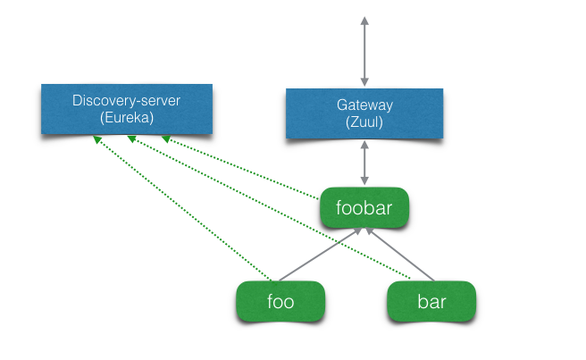
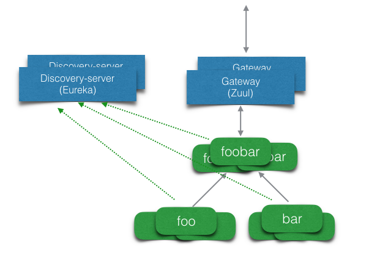

# Spring Cloud 微服务示例

## 概述

Spring Cloud提供了将Netflix开源产品集成到Spring Boot应用的能力，主要包括服务发现[Eureka](https://github.com/spring-cloud-samples/eureka)、熔断(Circuit Breaker) [Hystrix](http://cloud.spring.io/spring-cloud-netflix/spring-cloud-netflix.html)、智能应用路由[Zuul](https://github.com/spring-cloud-samples/zuul-server) 和客户端负载均衡[Ribbon](http://cloud.spring.io/spring-cloud-netflix/spring-cloud-netflix.html)。基于这个框架，开发人员可以非常容易地构建微服务应用。本示例已经Docker化，既可以在本地的测试环境中运行，也可以部署到阿里云容器服务上。

### 服务化应用
示例模拟的场景是企业内部应用服务化，服务之间通过API相互访问。foo服务和bar服务是两类基本服务，允许内网其他服务通过API访问，但不对外网提供服务。foobar对外提供服务，在处理时需要调用foo服务和bar服务。

服务发现机制由discovery-server提供，基于Eureka实现。由于discovery-server的业务无关性，开发人员可以直接使用Docker镜像。

foobar服务通过注册到智能应用路由gateway服务上对外提供服务，gateway基于Zuul，其代码业务无关，开发人员可以直接使用其Docker镜像，但由于zuul是通过配置文件来描述不同的服务对应的URL访问模式，所以在实际使用中需要改变镜像中的配置文件，或者通过挂载Volume实现配置文件的共享和修改。

foo, bar和foobar的代码中都包含了Eureka和Ribbon Client，实现了向Eureka的自注册和查询Eureka的能力，Ribbon实现了客户端的负载均衡。本示例中没有引入Hystrix。

### 逻辑架构

服务间的逻辑架构如下图所示。



每个服务在运行时都可以根据负载水平扩展或收缩，所以在运行的时候服务间的逻辑关系视图可以表示如下。




## 运行

### 本地运行Docker容器，数据库连接MySQL

在项目根目录下运行如下命令即可启动本地测试环境。

```sh
docker-compose up -d
```

### 部署到阿里云容器服务

使用MySQL，使用[docker-compose.yml](docker-compose.yml)。使用RDS见下文。


### 使用RDS（MySQL）数据库

数据库连接使用RDS的部署文件为（[docker-compose.acs.yml](docker-compose.acs.yml)）

docker-compose.acs.yml, 需要将```{rds-name}```替换为RDS（MySQL）的名字，并将下面的数据库、用户名和口令进行更新。

```yaml
  mysql:
    external:
      host: {rds-name}.mysql.rds.aliyuncs.com
      port: 3306
    environment:
      - MYSQL_ROOT_PASSWORD=passw0rd
      - MYSQL_DATABASE=foodb
      - MYSQL_USER=user1
      - MYSQL_PASSWORD=passw0rd
```

### OSSFS

如果在阿里云上开通了OSS，则可使用OSSFS。

```yaml
  bar:
    image: registry.aliyuncs.com/jingshanlb/bar
    environment:
      - EUREKA_SERVER_LIST=http://discovery1:8761/eureka/,http://discovery2:8761/eureka/
      - SPRING_PROFILES_ACTIVE=cloud
      - SERVER_PORT=8080
      - MANAGEMENT_PORT=8081
    volumes:
      - 'foobar_upload:/upload'
```

## 编译运行及构建镜像

### 为所有服务都构建镜像
```bash
./build-all.sh
```
运行前需要修改脚本中的```REGPREFIX```变量。

### 镜像全部上传到容器Hub
```bash
./push-all-images.sh
```
运行前需要修改脚本中的```REGPREFIX```变量，并Docker登录。

### 单独构建服务
```bash
cd {service directory}
./gradlew build
```

### 运行
```bash
cd {service directory}
java -jar build/libs/{service name}-0.0.1-SNAPSHOT.jar
```

### 构建Docker镜像
```bash
cd {service directory}
docker build -t {service name} .
```

### 访问服务

#### Discovery Server

返回在Eureka中注册的服务实例信息，JSON格式。

```bash
curl -H "Accept: application/json" http://{discovery hostname}:8761/eureka/apps
```

用浏览器访问```http://{discovery hostname}:8761/```显示Eureka页面。

#### Gateway

通过Gateway访问foobar页面。

```bash
curl http://{gateway hostname}:8080/acs/index.html
```

通过Gateway访问foobar API。

```bash
curl http://{gateway hostname}:8080/acs
curl http://{gateway hostname}:8080/acs/message
```

Spring Eureka server. Code in [discovery-server](discovery-server). Visit
[localhost:8761](http://localhost:8761/) to see which services are registered
in.

#### Foobar 服务

```bash
curl http://{hostname}:{port}/
curl http://{hostname}:{port}/message
```

Foobar通过Discovery Server找到foo和bar，```http://{hostname}:{port}/message```返回foo和bar组合消息。


#### Foo服务

```bash
curl http://{hostname}:{port}/message
```

Foo访问MySQL数据库，通过docker-compose文件中的参数配置变化，可以很容易地切换到阿里云RDS。

#### Bar服务

```bash
curl http://{hostname}:{port}/message
```
另外，Bar服务中包含```spring actuator```。配置信息在[services/bar/src/main/resources/application.yml](services/bar/src/main/resources/application.yml)

Actuator官方示例：[Building a RESTful Web Service with Spring Boot Actuator](https://spring.io/guides/gs/actuator-service/)

